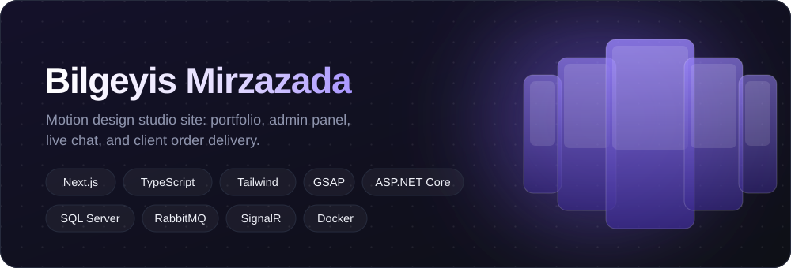
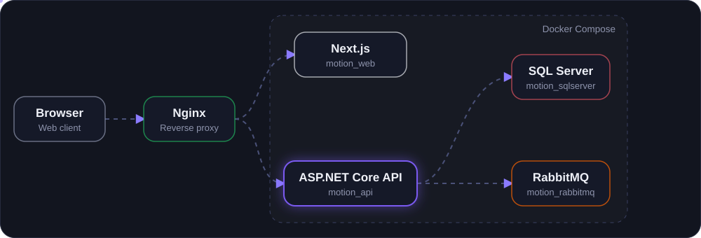

# Bilgeyis Mirzazada — Motion Portfolio

The public studio site, client account, and admin workspace for [bilgeyismirzazada.com](https://bilgeyismirzazada.com/).

**Live site:** https://bilgeyismirzazada.com/





Visitors browse the portfolio. Clients send a brief, sign in, follow an order, and chat. The studio runs the same system from `/admin`: content, inquiries, accounts, and delivery.

## Stack

| Layer | What it uses |
| --- | --- |
| Public site and admin | Next.js 15, React 19, TypeScript, Tailwind CSS, Framer Motion, GSAP, Lenis |
| API | ASP.NET Core on .NET 10, Entity Framework Core, JWT, SignalR, BCrypt |
| Data and queue | SQL Server (`MotionPortfolioDb`), RabbitMQ for new inquiries |
| Mail and media | Gmail SMTP, ImageSharp for sized public images |
| Production | Docker Compose (`motion_web`, `motion_api`, `motion_sqlserver`, `motion_rabbitmq`) behind Nginx |

Nginx sends `/` to Next.js and `/api`, `/uploads`, and the SignalR hub to the API. Public image requests can pass `?w=` so the API serves a display size. Delivery files stay at their original quality.

## Public site

English interface, SF Pro, day and night themes.

- Hero gallery of up to four images or videos. Width, height, corner radius, and fit come from admin, and the fan scales to the screen.
- Selected works with video, likes, and comments. Each piece has its own page at `/work/[id]`.
- Client logos, about, contact, and a structured brief (the client writes their own budget in USD or AZN).
- Stories on the studio mark.
- Account at `/account`: orders, discounts, and gifts.
- Order tracking at `/track/[token]`.
- Extra pages at `/p/[slug]`.
- Sections fade in as you scroll. Images and nearby videos are already loaded.

## Admin — `/admin`

English panel, JWT sign-in.

| Group | Sections |
| --- | --- |
| Workflow | Inquiries, accounts, testimonials |
| Site | Appearance, brief, announcements, about, logos, hero gallery, portfolio |
| Studio | Studio profile |

Inquiries move through New, In progress, Awaiting payment, Completed, and Cancelled. The studio can attach the finished work, email the client, and confirm payment before the file is released. Accounts show orders and the amount paid, and can set a password, remove an account, or email a discount or gift. Logos and portfolio rows have an order number; that number is the public order and is not shown on the site. Desktop still allows drag-and-drop.

## Team — `/team`

Team members sign in and see the jobs assigned to them, upload finished files, and chat with that client.

## Repository

```
Controllers/     ASP.NET Core API
Services/        RabbitMQ consumer and mail
web/             Next.js site, admin, team, and account
docker-compose.yml
```

The live snapshot of this studio is the `studio-updates` branch.

## Run locally

API (SQL Server and RabbitMQ need to be reachable with the connection settings in `appsettings` or environment variables):

```bash
dotnet run
```

Site:

```bash
cd web
npm install
npm run dev
```

The browser calls relative `/api/...` paths. In production Nginx routes those to the API. For a local Next server, proxy `/api` to the API or open the site through the same host setup used in production.

Production containers:

```bash
docker compose build
docker compose up -d
```
